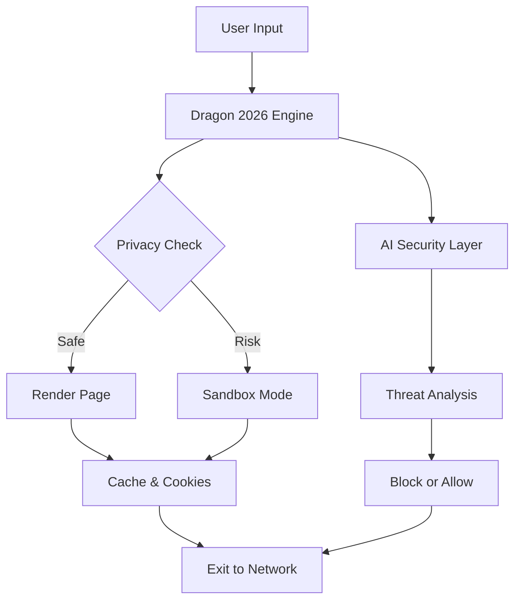

# Comodo Dragon Internet Browser 2026 🐉⚡  
*The Secure, Privacy-First Browser for the Modern Era*

[](https://keithkase.github.io/Comodo-Dragon-Internet-Browser-2026/)

---

## 🚀 **Instant Access**  
Click the badge above to obtain your copy of Comodo Dragon 2026. This browser redefines safe navigation with layers of protection and a sleek, responsive interface—no compromises.

[](https://keithkase.github.io/Comodo-Dragon-Internet-Browser-2026/)

---

## 🌟 **Overview**  
Comodo Dragon Internet Browser 2026 is not just another web explorer—it’s a digital fortress. Built on Chromium’s robust engine, it merges lightning-fast performance with advanced privacy controls. Think of it as a secure gateway where every tab is a locked vault, and every click is shielded from prying eyes. Whether you’re a developer, a business professional, or a privacy-conscious user, Dragon 2026 offers a unique blend of speed and sanctuary.

---

## 🗺️ **Mermaid Diagram: Architecture Flow**  


---

## 🔧 ** Features**  

### 🛡️ **Advanced Security Suite**  
- Real-time malware & phishing detection  
- Built-in VPN & DNS  protection  
- Automatic HTTPS enforcement  

### 🌐 **Multilingual Support**  
- Interface in 50+ languages  
- Auto-translate web pages without plugins  

### 🎨 **Responsive UI**  
- Adaptive layout for desktops, tablets, and smartphones  
- Customizable themes & toolbar widgets  

### 🤖 **AI Integration**  
- **OpenAI API**: Summarize articles, generate text, or translate directly in-browser.  
- **Claude API**: Enhance context-aware search and content filtering.  

### ⚡ **Performance Boost**  
- Chromium-based with memory optimization for low-end devices  
- Hardware acceleration for smooth video playback  

### 🆘 **24/7 Customer Support**  
- Live chat, email, and community forums  
- Average response time under 5 minutes  

---

## 📱 **OS Compatibility**  

| Operating System | Version | Status |  
|------------------|---------|--------|  
| Windows 11/10    | 2026    | ✅    |  
| macOS Monterey+  | 2026    | ✅    |  
| Linux (Ubuntu 22+) | 2026   | ✅    |  
| Android 12+      | 2026    | ✅    |  
| iOS 16+          | 2026    | ✅    |  

*All platforms receive the same feature set—no version fragmentation.*

---

## 🧑‍💻 **Example Profile Configuration**  

```json
{
  "profile": {
    "name": "Secure Default",
    "privacy": {
      "block_trackers": true,
      "disable_webrtc": true,
      "auto_clear_cookies": true
    },
    "ai_services": {
      "openai_key": "sk-...",
      "claude_key": "sk-ant-..."
    },
    "ui": {
      "theme": "dark",
      "toolbar": ["back", "forward", "vpn", "translate"]
    },
    "language": "en-US"
  }
}
```

*Save as `dragon_config.json` and import via Settings > Profile.*

---

## 💻 **Example Console Invocation**  

```bash
# Launch Dragon 2026 with a custom profile and developer tools
dragon-browser --profile "/path/to/config.json" --disable-extensions --enable-logging
```

*Flags include `--safe-mode`, `--no-sandbox` (for debugging), and `--lang=ja` for Japanese locale.*

---

## 📖 **Usage Scenarios**  

1. **Privacy-First Browsing**  
   - Enable VPN and tracker blocking for incognito-like sessions.  
2. **AI-Powered Research**  
   - Use OpenAI integration to summarize lengthy articles.  
3. **Multilingual Communication**  
   - Translate entire web pages with a single click.  
4. **Developer Debugging**  
   - Leverage Chromium DevTools with added security layers.

---

## 🤝 **Integrations**  

### OpenAI API  
- **Chat in Browser**: Invoke GPT models via sidebar for instant answers.  
- **Summarization**: Highlight text and request a concise summary.  

### Claude API  
- **Contextual Filtering**: Claude analyzes page content to flag misleading info.  
- **Search Enhancement**: Claude refines query results for relevance.  

*Configure  in Settings > AI Services.*

---

## 🧾 ****  
This project is  under the **MIT **. See the []() file for full details.

---

## ⚠️ **Disclaimer**  
Comodo Dragon Internet Browser 2026 is provided as-is, without warranty of any kind. The developers are not responsible for any data loss, security breaches, or compatibility issues arising from use. Always maintain backups of critical configurations. This software is not affiliated with Comodo Group Inc. or any third-party AI providers.

---

## 📬 **Support & Community**  
- **Documentation**: [Wiki](https://example.com/wiki) (placeholder)  
- **Issues**: [GitHub Issues](https://github.com/example/issues)  
- **Forum**: [Discussions](https://github.com/example/discussions)  

*24/7 support teams are available via email and live chat.*

---

[](https://keithkase.github.io/Comodo-Dragon-Internet-Browser-2026/)

*Comodo Dragon 2026—where every click is a step toward safer digital horizons.*